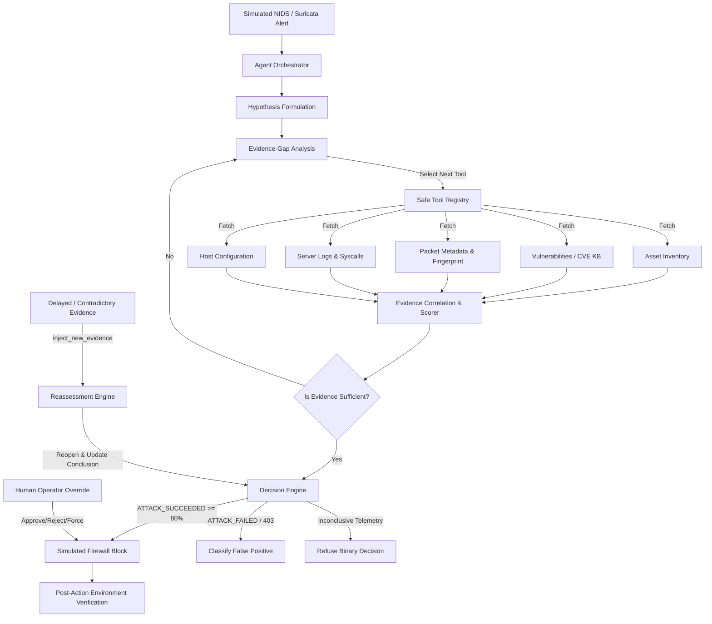

# SentinelFlow — Autonomous SOC Investigation & Response Agent

[](https://www.python.org/)
[](https://fastapi.tiangolo.com/)
[](https://react.dev/)
[](https://tailwindcss.com/)
[](https://opensource.org/licenses/MIT)

> **"SentinelFlow does not blindly trust security alerts. It investigates. It decides what evidence it needs. It correlates multiple sources. It determines whether an attack actually succeeded. It takes a controlled response. It verifies the result. And when new evidence appears, it can change its mind."**

---

## 1. Project Overview & Problem Statement

Modern Security Operations Centers (SOCs) face an existential alert fatigue crisis. NIDS, Suricata, and SIEM sensors generate tens of thousands of alerts daily. Over 80% of these alerts are either false positives, harmless scans, or attacks dropped by perimeter controls.

Existing AI security solutions attempt a naive approach:
$$\text{Alert} \longrightarrow \text{LLM} \longrightarrow \text{Static Summary}$$

This approach fails because:
1. **Alert signatures are deceptive**: A signature labeled "HIGH" may have been rejected by the web server (HTTP 403), while a "LOW" ping sweep might secretly exploit an unpatched Redis instance.
2. **Context is fragmented**: Proving an intrusion requires correlating network packets, asset inventory, CVEs, application configs, and host execution logs.
3. **Linear scripts cannot adapt**: When new forensic evidence appears, static playbooks fail to re-evaluate prior conclusions.

**SentinelFlow** solves this through **autonomous, non-linear agentic reasoning**. It identifies evidence gaps, queries sandboxed tools dynamically, determines true breach success, executes simulated containment, verifies host state changes, and adapts its conclusions when contradictory evidence emerges.

---

## 2. Architecture & Agent Loop



### The Autonomous Investigation Loop
```
while incident_not_resolved:
    observe()
    assess_current_evidence()
    identify_missing_evidence()
    if evidence_is_sufficient:
        determine_attack_outcome()
    else:
        select_best_next_tool()
        execute_sandbox_tool()
        validate_tool_result()
        add_evidence()
        update_hypothesis()
    if response_is_justified:
        execute_simulated_response()
        verify_response()
        update_conclusion()
    if human_override_exists:
        apply_override()
    if new_evidence_arrives:
        reconsider_previous_conclusion()
```

---

## 3. Sandboxed Safe Tools

SentinelFlow tools **NEVER interact with real networks or host operating systems**. All actions operate on synthetic MongoDB collections and sandbox state:

- `get_alert(alert_id)`: Retrieves simulated alert telemetry.
- `get_packet_metadata(alert_id)`: Returns synthetic packet counts, payload fingerprints, and sizes.
- `get_asset(asset_id_or_ip)`: Resolves hostnames, OS, criticality, and network zone.
- `get_vulnerabilities(asset_id)`: Queries synthetic CVE database for matching vulnerabilities.
- `get_server_logs(asset_id)`: Retrieves access logs, system calls, and database query traces.
- `get_configuration(asset_id)`: Inspects WAF policies, exposed ports, and TLS configs.
- `block_ip_simulated(ip, reason)`: Safely updates the sandbox `firewall_rules` collection.
- `verify_block(ip)`: Verifies whether the simulated firewall currently drops traffic from the IP.
- `inject_new_evidence(incident_id, evidence)`: Developer/demo tool allowing the UI to simulate delayed asynchronous evidence arriving.

---

## 4. Five Demonstration Scenarios

| # | Scenario | Alert | Target | Expected Outcome | Demonstrates |
| :- | :--- | :--- | :--- | :--- | :--- |
| **1** | **Confirmed Exploitation** | Apache Struts OGNL (HIGH) | Server-07 | `ATTACK_SUCCEEDED` (93%) | Multi-source correlation: vulnerable host + matching CVE + HTTP 200 execution -> Simulated block & verification. |
| **2** | **False Positive** | SQL Injection in URI (HIGH) | Server-03 | `ATTACK_FAILED` (88%) | Dropped by WAF (HTTP 403); zero host compromise; prevents alert fatigue. |
| **3** | **Ambiguous Activity** | TLS Tunneling Probe (MED) | Server-09 | `INSUFFICIENT_EVIDENCE` (54%) | Refuses forced binary hallucination when data is inconclusive. |
| **4** | **Low Severity but Successful** | Routine Keepalive Probe (LOW) | Server-02 | `ATTACK_SUCCEEDED` (89%) | Demonstrates the agent does not blindly trust severity labels; detects Redis Lua RCE. |
| **5** | **Dynamic Adaptation** | Async Header Injection (MED) | Server-05 | Initial: `FAILED` (72%) $\rightarrow$ Updated: `SUCCEEDED` (91%) | **Centerpiece Demo**: Delayed worker log injected; agent reopens case, adapts hypothesis, and reverses conclusion. |

---

## 5. Resilience & Security

1. **Tool Allowlisting**: The `ToolRegistry` enforces an allowlist. Unknown or arbitrary tool calls generated by LLMs are strictly rejected.
2. **Tool Failure Resilience**: Toggle `get_server_logs` offline via the UI. The agent detects the failure, avoids hallucination, and pivots to host configuration and local policies.
3. **No External Code Execution**: The LLM outputs structured JSON schemas, never raw bash/python commands.
4. **Dual Database Architecture**: Real MongoDB support via `motor`, with an automated in-memory sandbox fallback if MongoDB is not installed locally.

---

## 6. Quick Start & Installation

### Option A: 1-Click Startup (Windows)
Double-click `start.bat` in the project root:
```cmd
start.bat
```

### Option B: Docker Compose
```bash
docker compose up --build
```

### Option C: Manual Local Setup
#### 1. Backend Setup
```bash
cd backend
py -3.13 -m venv .venv
.venv\Scripts\pip install -r requirements.txt
.venv\Scripts\python -m app.simulation.seed
.venv\Scripts\python -m uvicorn app.main:app --host 0.0.0.0 --port 8000
```

#### 2. Frontend Setup
```bash
cd frontend
npm install
npm run dev
```

Open [http://localhost:5173](http://localhost:5173) in your browser.

---

## 7. Automated Test Suite

Run the full pytest suite (18 tests covering all scenarios, tools, adaptation, resilience, and API endpoints):
```bash
cd backend
.venv\Scripts\python -m pytest tests -v
```

---

## 8. License & Disclaimer
This project is an educational and synthetic cybersecurity simulation. It contains **no real malware, no real exploit code, and performs no real network scanning or host firewall modification**. All actions are strictly contained inside the synthetic sandbox environment.
