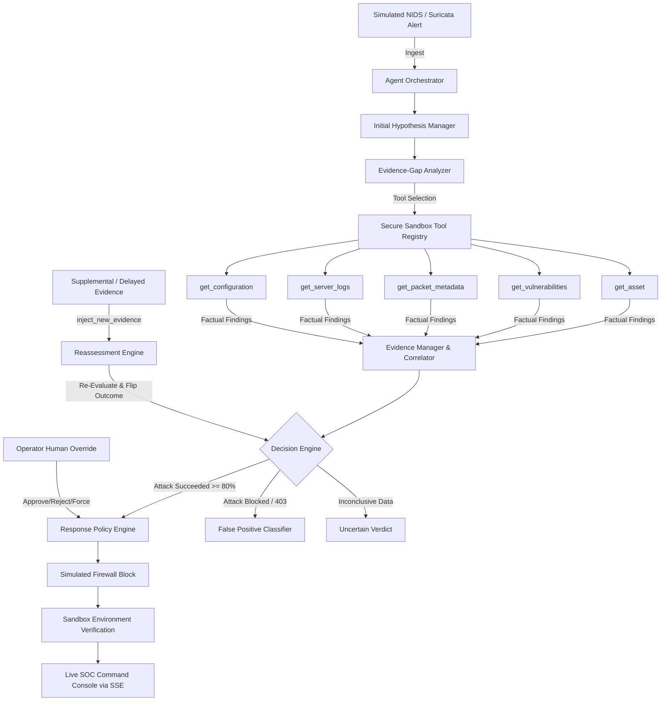

# SentinelFlow — Architecture Specification

## System Overview

SentinelFlow is an autonomous Security Operations Center (SOC) agent engineered to investigate simulated intrusion detection alerts, perform non-linear evidence correlation across disparate telemetry sources, evaluate host impact, take sandboxed defensive actions, and dynamically adapt its hypotheses as new evidence arrives.

## Core Architectural Layers

### 1. Zero Real-World Risk Sandbox Layer
All defensive actions (`block_ip_simulated`), asset queries, packet examinations, and log searches are strictly isolated within synthetic MongoDB collections (`firewall_rules`, `server_logs`, `assets`, `vulnerabilities`). No operating system iptables or network sockets are modified.

### 2. Multi-Provider AI Engine
Abstracted via `LLMProvider`:
- `MockProvider`: High-speed deterministic rule and correlation engine ensuring 100% demo reliability without external keys.
- `GeminiProvider`: Connects to Google Gemini API using structured JSON output schemas.
- `OpenAIProvider`: Connects to OpenAI API using JSON schema mode.

### 3. Resilience & Failure Handling
The `ToolRegistry` enforces an allowlist of safe tools and includes a simulated failure hook (`set_tool_failure("get_server_logs", True)`). When an outage is simulated, the agent avoids hallucinating, detects the failure event, and pivots to alternative telemetry sources (e.g. host configuration and WAF policy state).

### 4. Dynamic Adaptation Loop
Unlike sequential scripts, SentinelFlow treats incidents as living state machines. If delayed worker logs are discovered or an operator provides contradictory evidence, the incident is reopened, the reasoning trace documents the contradiction, and the conclusion adapts in real time.
